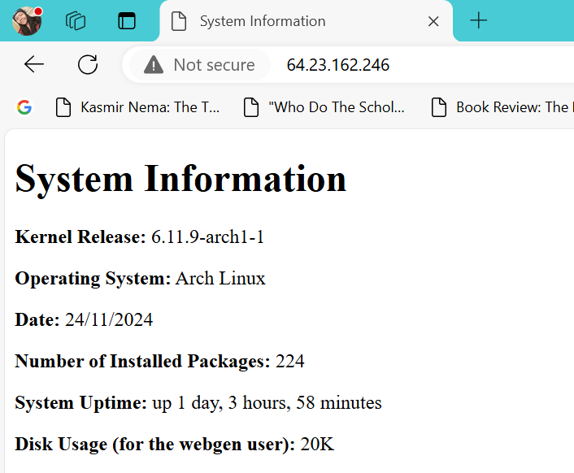

# Linux Assignment III - Part 1  
# SALOME CHELSIE LELE WAMBO

# Script Purpose

This project sets up a Bash script to generate a static `index.html` file containing system information. The file is served by an Nginx web server and secured with a firewall using UFW. The system is automated using a systemd service and timer to run daily at 5:00 AM PST.

## Features

- Generates an HTML page with system information such as:
  - Kernel release
  - Operating system name
  - Current date
  - Number of installed packages
  - System uptime
  - Disk usage (specific to `webgen`)
- Automates the script execution using systemd service and timer.
- Serves the HTML page using an Nginx on port 80.
- Secures the server with UFW by:
  - Allowing SSH and HTTP traffic
  - Enabling SSH rate limiting
- Provides setup instructions for a new server.

## Prerequisites

- Basic bash scripting.
- An Arch Linux server.
- Root access or `sudo` privileges.
- Installed packages:
  - `nginx`
  - `ufw`
  - `git`
  Can be installed with `sudo pacman -S nginx ufw git`.  

## Repository File Descriptions and Server Locations

This repository contains all the necessary files to set up and automate the generation of the `index.html` file. Below is a description of each file and its required location on the server:

1. **`generate_index`**
   - **Description**: A Bash script that generates the `index.html` file containing system information.
   - **Location**: `/var/lib/webgen/bin/`

2. **`generate-index.service`**
   - **Description**: A systemd service file that runs the `generate_index` script to update the `index.html` file.
   - **Location**: `/etc/systemd/system/`

3. **`generate-index.timer`**
   - **Description**: A systemd timer file that schedules the `generate-index.service` to run daily at 5:00 AM.
   - **Location**: `/etc/systemd/system/`

4. **`nginx.conf`**
   - **Description**: The main Nginx configuration file, modified to include the `sites-enabled` directory for managing server blocks.
   - **Location**: `/etc/nginx/`

5. **`generate-index.conf`**
   - **Description**: An Nginx server block configuration file that serves the `index.html` file.
   - **Location**: `/etc/nginx/sites-available/`

6. **`Screenshot-success-it-works.png`**
   - **Description**: A screenshot demonstrating the successful operation of the setup.

### Step 1: Create a System User

1. Create a non-login system user `webgen` with a home directory:

`sudo useradd -r -m -d /var/lib/webgen -s /usr/sbin/nologin webgen`  

> Note:  
Creating a **system user** like `webgen` for this task provides several benefits:
- **Security**: A system user with no login shell and restricted permissions limits potential vulnerabilities. Even if the user is compromised, it cannot directly access other parts of the system.
- **Isolation**: Keeps files and processes for this task separate from other users or services, making management and debugging easier.
- **Minimized Risk**: Running services as root is dangerous because any misconfiguration or compromise could allow full system access.  

2. Ensure the user owns its directory:  

`sudo chown -R webgen:webgen /var/lib/webgen`  
`sudo chmod -R 755 /var/lib/webgen`  

3. Create the required directories:
```bash
mkdir -p /var/lib/webgen/bin
mkdir -p /var/lib/webgen/HTML
```

### Step 2: Clone the Repository

1. Clone this repository into `/var/lib/webgen/bin/`:
```bash
sudo mkdir -p /var/lib/webgen/bin/
sudo -u webgen git clone  https://github.com/ChelsieSalome/Linux-Assignment-3-part-1.git /var/lib/webgen/bin/
```

2. Ensure the following files from the repository are in the correct locations on the server:
    * **`generate_index`** : Script that generates the index.html file. 
        *Already located in `/var/lib/webgen/bin/` after cloning the repository. This script generates the `index.html` file.*  

    * **`generate-index.service`**: Copy this file to `/etc/systemd/system/`:  
        `sudo cp /var/lib/webgen/bin/generate-index.service /etc/systemd/system/`  

    * **`generate-index.timer`**: Copy this file to `/etc/systemd/system/`  
        `sudo cp /var/lib/webgen/bin/generate-index.timer /etc/systemd/system/`  

    - **`nginx.conf`**: This file configures the Nginx server. If there is already an `/etc/nginx/nginx.conf` file on your system, follow these steps:  

    1. **Back up the Existing Configuration**:
     ```sudo cp /etc/nginx/nginx.conf /etc/nginx/nginx.conf.bak```  

    2. **Compare and Merge Changes**:
        Open the existing `/etc/nginx/nginx.conf` and the repository's `nginx.conf` to identify differences. Ensure the following changes are made:  
        
        - Replace the `user` directive (usually near the top of the file) with:  
        ```user webgen;```  
        - Ensure the `http` block includes the following at the end:  
        ```include /etc/nginx/sites-enabled/*;```

    3. **Test the Configuration**:
        After merging the changes, test the Nginx configuration:
        ```sudo nginx -t```  

    4. **Restart Nginx**:  
        Restart the Nginx service to apply changes:  
        ```sudo systemctl restart nginx ```

    5. **If the Backup is Needed**:  
        If something goes wrong, restore the original configuration:  
        ```sudo cp /etc/nginx/nginx.conf.bak /etc/nginx/nginx.conf```  
        ```sudo systemctl restart nginx```  

    * **`generate-index.conf`**: Copy this file to **/etc/nginx/sites-available/**:  
        `sudo cp /var/lib/webgen/bin/generate-index.conf /etc/nginx/sites-available/`
        > **Note**:  
        Using a separate server block file instead of modifying the main nginx.conf file directly offers to following advantages:  
        1. It keeps each site's configuration in its own file which is practical if your server is managing multiple files.  
        2. You can enable or disable individual configurations without affecting the main `nginx.conf`.  
        3. Editing `nginx.conf` directly increases the risk of breaking the entire Nginx setup due to errors in the configuration.  
    

### Step 3: Configure Nginx

1. **Create the Directories (If They Don't Exist)**:  

Nginx does not create `sites-available` and `sites-enabled` by default. Create these directories:  

   ```bash
   sudo mkdir -p /etc/nginx/sites-available
   sudo mkdir -p /etc/nginx/sites-enabled
   ```

2. Enable the Site: Create a symlink in the **sites-enabled directory** to enable the server block:  

`sudo ln -s /etc/nginx/sites-available/generate-index.conf /etc/nginx/sites-enabled/`

3. Test and reload Nginx:  

```bash
sudo nginx -t
sudo systemctl reload nginx
```

### Step 4: Enable and Start Systemd Service and Timer

1. Reload systemd:
`sudo systemctl daemon-reload`

2. Enable the service and timer:
```bash
sudo systemctl enable --now generate-index.service
sudo systemctl enable --now generate-index.timer
```
3. To verify that the timer is active and that the service runs successfully, run: 
* `systemctl list-timers` to **Check active timers**.  
* `journalctl -u generate-index.service` to Check service logs.  

### Step 5: Configure UFW

Allow SSH and HTTP traffic and enable ufw:

```bash
sudo pacman -S ufw
sudo ufw allow ssh
sudo ufw allow http
sudo ufw limit ssh
sudo ufw enable
```
>**WARNING !**:  
You mush allow SSH traffic before enabling the ufw service, because if you enable UFW (Uncomplicated Firewall) without allowing SSH traffic, you could inadvertently lock yourself out of your server, especially if you're managing it remotely.  

Check the status:
`sudo ufw status`

### Step 6: Ensure your server is running  
After completing the setup, verify that your server is running and accessible:
1. Open a web browser.  
2. Enter your server's public IP address (e.g., http://<your-server-ip>).  
3. You should see the system information displayed on the webpage as such: 



# Enhancements to `generate_index` Script  
Possible ways to enhance the `generate_index` script include:  

1. **Adding Error Logs for Key Variables**:  
For critical variables such as `KERNEL_RELEASE`, `DATE`, and `UPTIME`, error messages are logged to standard error (`>&2`) if their retrieval fails.  

2. **Disk Usage Information for the `webgen` User**:
- The script calculates the total disk usage of the `webgen` user directory (`/var/lib/webgen`) using the `du` command:
```DISK_USAGE=$(du -sh /var/lib/webgen 2>/dev/null | awk '{print $1}')```
   - This information is included in the generated `index.html` file.  

3. **Improved Directory Validation**:
   - Before creating the `index.html` file, the script verifies that the target directory (`/var/lib/webgen/HTML`) exists. If it doesn’t, the script logs an error and exits.

4. **HTML Updates**:
   - The generated `index.html` file now includes:
     - Disk usage for the `webgen` user.

# Troubleshooting Tips  
## 1. Nginx Fails to Start or Reload
- Run the following to check the configuration:
```bash
sudo nginx -t
```  
If there are syntax errors, review the changes made to /etc/nginx/nginx.conf or the server block file in /etc/nginx/sites-available/.  

## 2. "generate_index" Script Fails
* Check the logs for the systemd service:  
`journalctl -u generate-index.service`  

* Ensure the script is executable:  
`sudo chmod +x /var/lib/webgen/bin/generate_index`

## 3. Missing Firewall Rules  
* Check the UFW status:
`sudo ufw status verbose`  

* Ensure you have allowed the necessary ports:  
```bash
sudo ufw allow ssh
sudo ufw allow http
```
## 4. Site Not Accessible in Browser of Browser displaying the defauld Nginx index.html page  
* Verify Nginx is running:
`sudo systemctl status nginx`  

* Clear your browser's cache   
* Use a different browser.  

# Sources
1. https://learning.oreilly.com/library/view/linux-for-system/9781803247946/B18575_02.xhtml#_idParaDest-32  
2. https://wiki.archlinux.org/title/Nginx  
3. https://wiki.archlinux.org/title/Uncomplicated_Firewall  
4. https://www.digitalocean.com/community/tutorials/how-to-use-systemctl-to-manage-systemd-services-and-units  
5. https://www.digitalocean.com/community/tutorials/understanding-systemd-units-and-unit-files  
6. https://wiki.archlinux.org/title/Systemd/Timers  


